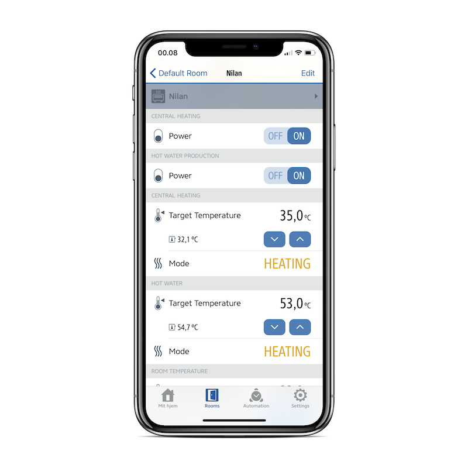

Nilan-HK is experimental HomeKit accessory implementation for Nilan (R) CTS700 heatpump.
It communicates with Nilan heatpump via Modbus protocol and exposes various readings
and settings using Apple HomeKit Accessory Protocol (HAP). Nilan can be accessed and
controller from HomeKit-enabled apps, such as Apple Home or Eve.

Software is implemented in Go and is based on [hc](https://github.com/brutella/hc) framework.

Nilan settings in [Eve](https://apps.apple.com/us/app/eve-for-homekit/id917695792) app:



## Hardware setup

Accessory software is designed for Raspbery Pi computer connected to Nilan heatpump via
Ethernet cable. For complete hardware setup, refer to
[this wiki page](https://github.com/pjuzeliunas/nilan-client-ios/wiki/Setup).

## Software setup (quick guide)

1. Install Go
2. Configure environment variables:
    - `HK_PIN`: 8 digit PIN code which must be used to authenticate iOS device against accessory. E.g. `"00102003"`.
    - `NILAN_ADDRESS` (optional): Address and port (default 502) of Nilan heatpump. If variable
is not provided, accessory software uses factory address of Nilan, which is "192.168.5.107:502".
2. Build and run the app with:
```
go build -o nilan-hk nilan.go
./nilan-hk
```

## Software setup (verbose guide)

1. Install Go (minimum version 1.11). For Raspbian, run the following commands:
```
wget https://storage.googleapis.com/golang/go1.11.8.linux-armv6l.tar.gz
sudo tar -C /usr/local -xzf go1.11.8.linux-armv6l.tar.gz
echo "export PATH=$PATH:/usr/local/go/bin" >> ~/.profile
source ~/.profile
```

2. Clone this repo
```
git clone pjuzeliunas/nilan-hk
cd pjuzeliunas/nilan-hk
```

3. Install dependencies
```
go get -u ./...
```

4. Build accessory software:
```
go build -o nilan-hk nilan.go
```

5. Provide environment variables and run the software:
```
export HK_PIN=00102003
export NILAN_ADDRESS=192.168.1.20:502
./nilan-hk
```
  - `HK_PIN`: 8 digit PIN code which must be used to authenticate iOS device against accessory.
  - `NILAN_ADDRESS` (optional): Address and port (default 502) of Nilan heatpump. If variable
is not provided, accessory software uses factory address of Nilan, which is "192.168.5.107:502".

If various Nilan readings start being logged, then your software is running as it should. You should
now be able to add the accessory to HomeKit-enabled app.

## Set `nilan-hk` up as a service

If you want Nilan-HK to be running in background and to start automatically after every reboot,
then you have to make it a service. Steps are for Raspbian OS, but you can use them for inspiration
on other OS too.

1. First of all, build `nilan-hk` binary as described in the previous steps.
2. Copy `nilan-hk` to `/usr/bin/`
3. Create `/etc/systemd/system/nilan-hk.service` text file with the following content:
```
[Unit]
Description=Serve Nilan HomeKit via HAP

[Service]
Environment=NILAN_ADDRESS=192.168.1.20:502
Environment=HK_PIN=00102003
ExecStart=/usr/bin/nilan-hk
Restart=on-failure

[Install]
WantedBy=multi-user.target 
```
Remember to adjust environment variables in the file. `NILAN_ADDRESS` variable is optional.

4. Start the service:
```
sudo systemctl start nilan-hk.service
```
5. Enable the service after every reboot:
```
sudo systemctl enable nilan-hk.service
```

## Limitations and notes

- Room temperature thermostat will always show `OFF` state when it is set to `AUTO` mode. That
  doesn't mean that heating/cooling is actually off. It just runs is auto mode. This limitation
  is twofold:
  - Apple HAP does not permit having other thermostat (actual) state values than
    off/heating/cooling.
  - In the world of Nilan, "heating" means normal operation without cooling, "cooling"
  means normal operation without heating and "auto" means just normal operation, in which
  heating and cooling can be done at the same time. There is no easy way of knowing wether
  Nilan is heating or cooling at the moment, as it can be doing both in parallel.
- Switching Central Heating off will simply put it to standby mode (aka pause) for 180 days.
  After 180 days it will turn on automatically. Swithing it back on will resume normal
  operation. You can always prolong standby mode by 180 days by turning the switch on and
  off again.
- Same logic applies for Hot Water Production switch: off means 180 days pause.

- Some HAP characteristics of Nilan have non-standard read/write permission attribute, which means
  that UI in some apps (like Apple Home) might appear distorted. The following services are affected by non-standard access permission attribute on some characteristics:
  - Fan:
    - `Active`: is read-only.
    - According to HAP, `Active` characteristing should be writable. However, Nilan made it pretty
    difficult to switch the ventilation off in its own CTS700 console (most likely because
    the ventilation system is designed for running 24/7). With full respect to Nilan design, author made
    a deliberate choice not to allow switching the ventilation off using HomeKit protocol.
    - In Apple Home app: switching the Fan off will have no effect.
  - Supply Flow thermostat:
    - `TargetHeatingCoolingState` is read-only.
    - According to HAP, `TargetHeatingCoolingState` of thermostat should permit write operation with
      one of the 4 possible values: auto, cool, heat or off. Some values are not logical in
      Nilan supply flow settings, and therefore author decided to disable write access.
  - Hot Water thermostat:
    - `TargetHeatingCoolingState` is read-only.
    - Same reasoning as in supply flow thermostat.

## Disclaimer

This initial version of software is developed by home automation enthusiast (outside Nilan company) and
is based on open Nilan
[CTS700 Modbus protocol](https://www.nilan.dk/Admin/Public/DWSDownload.aspx?File=%2fFiles%2fFiler%2fDownload%2fDanish%2fDokumentation%2fSoftware+vejledninger%2fModbus%2fCTS700_Modbus_protokol.pdf).

Nilan is a registered trademark and belongs to [Nilan A/S](https://www.nilan.dk/).
